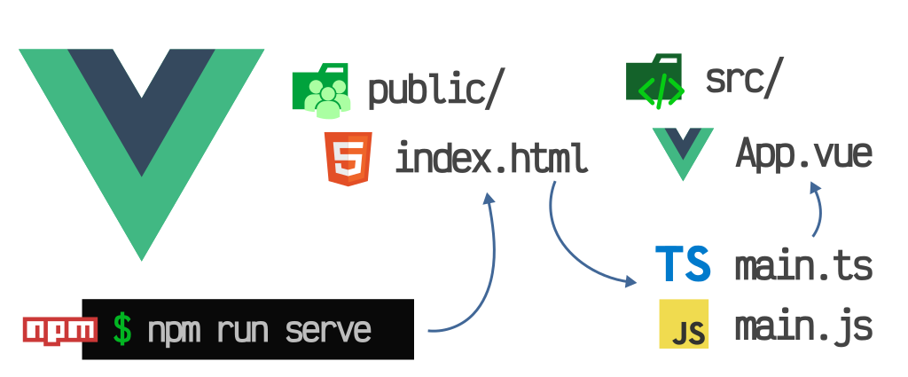

# Configuración del entorno de trabajo

En esta sección vamos a ver cómo configurar nuestro entorno de trabajo para poder desarrollar con Vue.js y JavaScript.

[](https://es.vuejs.org/)
[](https://joseluisgs.github.io/docs/license/)




- [Configuración del entorno de trabajo](#configuración-del-entorno-de-trabajo)
  - [Acerca de](#acerca-de)
  - [Contenidos](#contenidos)
  - [Instalación de Node.js](#instalación-de-nodejs)
  - [Instalación de Visual Studio Code](#instalación-de-visual-studio-code)
  - [Extensiones de Visual Studio Code recomendadas](#extensiones-de-visual-studio-code-recomendadas)
  - [Vue Developer Tools](#vue-developer-tools)
  - [Autor](#autor)
    - [Contacto](#contacto)
    - [¿Un café?](#un-café)
  - [Licencia de uso](#licencia-de-uso)

## Acerca de
En este apartado vamos a ver cómo configurar nuestro entorno de trabajo para poder desarrollar con Vue.js y JavaScript.

## Contenidos
1. Instalación de Node.js y NPM
2. Instalación de Visual Studio Code
3. Extensiones de Visual Studio Code recomendadas
4. Vue Developer Tools

## Instalación de Node.js
Node.js es un entorno de ejecución para JavaScript construido con el motor de JavaScript V8 de Chrome. Node.js usa un modelo de operaciones E/S sin bloqueo y orientado a eventos, que lo hace liviano y eficiente. El ecosistema de paquetes de Node.js, npm, es el ecosistema más grande de librerías de código abierto en el mundo.

Instalaremos la última version LTS, disponible aquí: https://nodejs.org/es/

Para comprobar que se ha instalado correctamente, abriremos una terminal y ejecutaremos el comando:

```bash
node -v
```

NPM es el gestor de paquetes de Node.js, y viene incluido con la instalación de Node.js. Para comprobar que se ha instalado correctamente, abriremos una terminal y ejecutaremos el comando:

```bash
npm -v
```

## Instalación de Visual Studio Code
Visual Studio Code es un editor de código fuente desarrollado por Microsoft para Windows, Linux y macOS. Incluye soporte para depuración, control de versiones Git incorporado, resaltado de sintaxis, finalización inteligente de código, snippets y refactoring de código.

Instalaremos la última version, disponible aquí: https://code.visualstudio.com/

## Extensiones de Visual Studio Code recomendadas
Para poder trabajar con Vue.js, es recomendable instalar las siguientes extensiones:
- [Volar](https://marketplace.visualstudio.com/items?itemName=vue.volar): Extensión de Vue.js para Visual Studio Code, realizada por el equipo de Vue.js.
- [Vue VSCode Snippets](https://marketplace.visualstudio.com/items?itemName=sdras.vue-vscode-snippets): Snippets para Vue.js en Visual Studio Code
- [Vue.js Extension Pack](https://marketplace.visualstudio.com/items?itemName=mubaidr.vuejs-extension-pack): Extensiones recomendadas para Vue.js
- [Auto Close Tag](https://marketplace.visualstudio.com/items?itemName=formulahendry.auto-close-tag): Cierre automático de etiquetas HTML
- [Auto Complete Tag](https://marketplace.visualstudio.com/items?itemName=formulahendry.auto-complete-tag): Completado automático de etiquetas HTML
- [Auto Rename Tag](https://marketplace.visualstudio.com/items?itemName=formulahendry.auto-rename-tag): Renombrado automático de etiquetas HTML
- [Color Highlight](https://marketplace.visualstudio.com/items?itemName=naumovs.color-highlight): Resaltado de colores
- [Error Lens](https://marketplace.visualstudio.com/items?itemName=usernamehw.errorlens): Resaltado de errores
- [ESLint](https://marketplace.visualstudio.com/items?itemName=dbaeumer.vscode-eslint): Integración de ESLint en Visual Studio Code
- [HTML CSS Support](https://marketplace.visualstudio.com/items?itemName=ecmel.vscode-html-css): Soporte para HTML y CSS
- [JavaScript (ES6) code snippets](https://marketplace.visualstudio.com/items?itemName=xabikos.JavaScriptSnippets): Snippets de JavaScript
- [Prettier](https://marketplace.visualstudio.com/items?itemName=esbenp.prettier-vscode): Integración de Prettier en Visual Studio Code

## Vue Developer Tools
Para poder depurar nuestra aplicación, es recomendable instalar las siguientes extensiones en nuestro navegador:
- [Vue.js devtools](https://devtools.vuejs.org/guide/installation.html)

## Autor

Codificado con :sparkling_heart: por [José Luis González Sánchez](https://twitter.com/joseluisgonsan). 

[](https://twitter.com/joseluisgonsan)
[](https://github.com/joseluisgs)

### Contacto
<p>
  Cualquier cosa que necesites házmelo saber por si puedo ayudarte 💬.
</p>
<p>
 <a href="https://joseluisgs.github.io/" target="_blank">
        
    </a>  &nbsp;&nbsp;
    <a href="https://github.com/joseluisgs" target="_blank">
        
    </a> &nbsp;&nbsp;
        <a href="https://twitter.com/joseluisgonsan" target="_blank">
        
    </a> &nbsp;&nbsp;
    <a href="https://www.linkedin.com/in/joseluisgonsan" target="_blank">
        
    </a>  &nbsp;&nbsp;
    <a href="https://discordapp.com/users/joseluisgs#3560" target="_blank">
         
    </a> &nbsp;&nbsp;
    <a href="https://g.dev/joseluisgs" target="_blank">
        
    </a>    
</p>

### ¿Un café?
<p><a href="https://www.buymeacoffee.com/joseluisgs"> </a></p><br><br><br>

## Licencia de uso

Este repositorio y todo su contenido está licenciado bajo licencia **Creative Commons**, si desea saber más, vea la [LICENSE](https://joseluisgs.github.io/docs/license/). Por favor si compartes, usas o modificas este proyecto cita a su autor, y usa las mismas condiciones para su uso docente, formativo o educativo y no comercial.

<a rel="license" href="http://creativecommons.org/licenses/by-nc-sa/4.0/"></a><br /><span xmlns:dct="http://purl.org/dc/terms/" property="dct:title">JoseLuisGS</span> by <a xmlns:cc="http://creativecommons.org/ns#" href="https://joseluisgs.github.io/" property="cc:attributionName" rel="cc:attributionURL">José Luis González Sánchez</a> is licensed under a <a rel="license" href="http://creativecommons.org/licenses/by-nc-sa/4.0/">Creative Commons Reconocimiento-NoComercial-CompartirIgual 4.0 Internacional License</a>.<br />Creado a partir de la obra en <a xmlns:dct="http://purl.org/dc/terms/" href="https://github.com/joseluisgs" rel="dct:source">https://github.com/joseluisgs</a>.