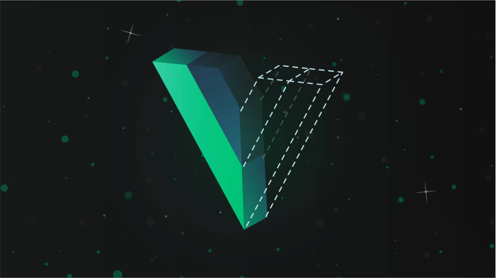

# Vue.js Intermedio

Comenzaremos con las bases de Vue.js


[](https://es.vuejs.org/)
[](https://joseluisgs.github.io/docs/license/)




- [Vue.js Intermedio](#vuejs-intermedio)
  - [Acerca de](#acerca-de)
  - [Propiedades](#propiedades)
  - [Eventos](#eventos)
  - [Comunicación entre componentes](#comunicación-entre-componentes)
  - [Ciclos de vida de un componente](#ciclos-de-vida-de-un-componente)
  - [Elementos dependientes del estado o similar](#elementos-dependientes-del-estado-o-similar)
  - [Estilos condicionales](#estilos-condicionales)
  - [Referencias a elementos del template](#referencias-a-elementos-del-template)
  - [Slots](#slots)
  - [Referencias](#referencias)
  - [Ejercicios](#ejercicios)
  - [Autor](#autor)
    - [Contacto](#contacto)
    - [¿Un café?](#un-café)
  - [Licencia de uso](#licencia-de-uso)

## Acerca de
Abordaremos los temas a nivel intermedio de Vue.js

## Propiedades
Las [propiedades](https://vuejs.org/guide/components/props.html#props) son las variables que se le pasan al componente para instanciarlo. De esta manera podemos parametrizarlo para reutilizarlo. Pueden ser requeridas o no, además podemos tiparlas o darles un valor por defecto. También podemos validarlas para filtrar el valor asignado.

```js
// Mis propiedades
    // Mis propiedades
    props: {
      // count: Number, podemos definirla en una sola linea o con más opciones...
      titulo: {
        type: String, // Tipo de dato
        default: 'Contador', // valor por defecto (opcional)
        required: true, // es obligatorio pasarselo (opcional)
      },
      started: {
        type: Number,
        default: 0,
        required: true,
        // Validaro es opcional
        validator(value) {
          return value >= 2
        },
      },
    },
```

## Eventos

De la misma manera que las propiedades nos sirven para pasar valores del padre al hijo, los [eventos](https://vuejs.org/guide/components/events.html) nos sirven para pasar valores del hijo al padre. Usaremos emits para hacerlo.

```js
// desde el componente hijo que emite el evento
// eventos que emito hay que anunciarlos
emits: ['question-response'],
  //...
  // Mandamos el evento y su parámetro, si lo hay
  this.$emit('question-response', this.answer)
```

```js
// desde el padre lo recogemos, como un evento normal y lo procesamos
<Indecision @question-response="callbackQuestionResponse" />
//...
methods: {
      callbackQuestionResponse(data) {
        console.log('He recibido el evento: ', data)
      },
    },
```


## Comunicación entre componentes
- Padre a hijo: Usa propiedades
- Hijo a padre: Usa eventos
- Si la cosa se complica o hay muchos saltos, usa una store (lo veremos en conceptos avanzados)

## Ciclos de vida de un componente
Saber el [ciclo de vida de un componente](https://vuejs.org/guide/essentials/lifecycle.html) nos ayuda a saber como usar los hooks y con ellos [disparar acciones asociadas al ciclo de vida del componente](https://vuejs.org/api/options-lifecycle.html). Como son beforeCreated() => created() => beforeMount() => mounted() => beforeUpdate() => updated(), beforeUnmount(), unmounted().

Para la options API que veremos más adelante, usaremos: https://vuejs.org/api/composition-api-lifecycle.html


## Elementos dependientes del estado o similar
Podemos hacer uso de ellos por ejemplo poniendo : y el valor de la propiedad que queremos usar. Por ejemplo si queremos que una imagen o texto cambie en función de una propiedad, podemos usarlo:

```html

```

## Estilos condicionales
Es una ampliación del anterior. En Vue.js podemos usar [clases y estilos condicionales de CSS](https://vuejs.org/guide/essentials/class-and-style.html) y de esta manera podemos cambiar el aspecto de un componente en función de su estado.
```js
data() {
  return {
    isActive: true,
    hasError: false
  }
}
```
```html
<div
  class="static"
  :class="{ active: isActive, 'text-danger': hasError }"
></div>
```

```html
<div class="static active"></div>
```

## Referencias a elementos del template
Podemos hacer referencias a cualquier elemento del DOM del template usando [ref](https://vuejs.org/guide/essentials/template-refs.html). De esta manera podemos acceder a él desde el script y hacer lo que queramos con él. Por ejemplo, podemos usarlo para hacer focus en un input.

```html
<input ref="input">
```

```js
this.$refs.input.focus()
```

## Slots
Los [slots](https://vuejs.org/guide/components/slots.html#slots) nos permiten pasar un template o código html a un componente. De esta manera podemos tener un componente y nosotros pasar el aspecto que se quiera, es decir, personalizar su template.


Sin embargo, hay casos en los que podría ser útil si el contenido de un slot puede hacer uso de datos tanto del ámbito principal como del secundario. Para lograr eso, necesitamos una forma de que se pasen datos entre ambos. Son los scoped slots.


```html
<MyComponent v-slot="slotProps">
  {{ slotProps.text }} {{ slotProps.count }}
</MyComponent>
```


## Referencias 
- [Vue.js](https://vuejs.org/guide/introduction.html)


## Ejercicios
Este tema tiene varios ejercicios, puedes realizarlos [aquí](./EJERCICIOS.md)

## Autor

Codificado con :sparkling_heart: por [José Luis González Sánchez](https://twitter.com/joseluisgonsan). 

[](https://twitter.com/joseluisgonsan)
[](https://github.com/joseluisgs)

### Contacto
<p>
  Cualquier cosa que necesites házmelo saber por si puedo ayudarte 💬.
</p>
<p>
 <a href="https://joseluisgs.github.io/" target="_blank">
        
    </a>  &nbsp;&nbsp;
    <a href="https://github.com/joseluisgs" target="_blank">
        
    </a> &nbsp;&nbsp;
        <a href="https://twitter.com/joseluisgonsan" target="_blank">
        
    </a> &nbsp;&nbsp;
    <a href="https://www.linkedin.com/in/joseluisgonsan" target="_blank">
        
    </a>  &nbsp;&nbsp;
    <a href="https://discordapp.com/users/joseluisgs#3560" target="_blank">
         
    </a> &nbsp;&nbsp;
    <a href="https://g.dev/joseluisgs" target="_blank">
        
    </a>    
</p>

### ¿Un café?
<p><a href="https://www.buymeacoffee.com/joseluisgs"> </a></p><br><br><br>

## Licencia de uso

Este repositorio y todo su contenido está licenciado bajo licencia **Creative Commons**, si desea saber más, vea la [LICENSE](https://joseluisgs.github.io/docs/license/). Por favor si compartes, usas o modificas este proyecto cita a su autor, y usa las mismas condiciones para su uso docente, formativo o educativo y no comercial.

<a rel="license" href="http://creativecommons.org/licenses/by-nc-sa/4.0/"></a><br /><span xmlns:dct="http://purl.org/dc/terms/" property="dct:title">JoseLuisGS</span> by <a xmlns:cc="http://creativecommons.org/ns#" href="https://joseluisgs.github.io/" property="cc:attributionName" rel="cc:attributionURL">José Luis González Sánchez</a> is licensed under a <a rel="license" href="http://creativecommons.org/licenses/by-nc-sa/4.0/">Creative Commons Reconocimiento-NoComercial-CompartirIgual 4.0 Internacional License</a>.<br />Creado a partir de la obra en <a xmlns:dct="http://purl.org/dc/terms/" href="https://github.com/joseluisgs" rel="dct:source">https://github.com/joseluisgs</a>.